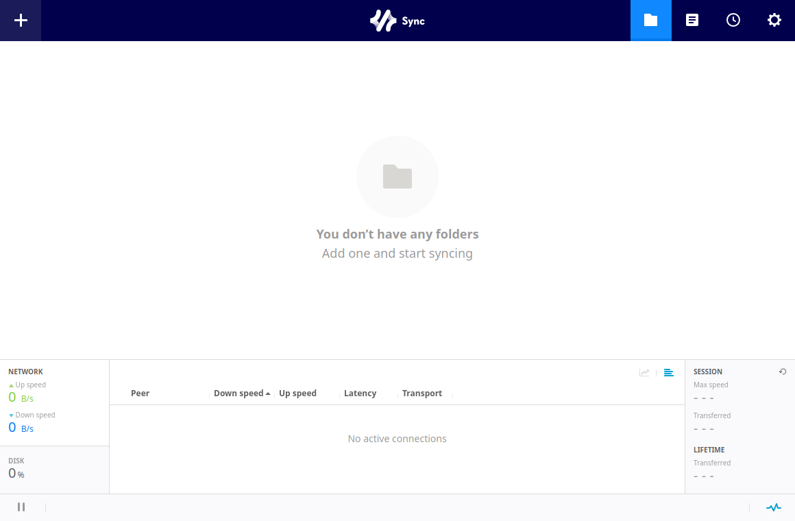

# SyncPilot

[Resilio Sync](https://www.resilio.com/individuals/)（`rslsync`）的 Linux 原生桌面壳——在桌面窗口内嵌**官方 Resilio Web UI**，界面与操作流程和官方 Windows/macOS 客户端完全一致，并补齐 Linux 缺的部分：守护进程管理、开机自启、崩溃看护和官方二进制首次运行安装。

[](https://github.com/turinglambdaai/syncpilot/releases/latest)   [](LICENSE)

[English](README.md) · **中文** · 🌐 [syncpilot.jrtx.site](https://syncpilot.jrtx.site/)

SyncPilot 在原生窗口内运行并管理官方 `rslsync` 守护进程，窗口里显示的就是官方 Resilio Web UI。它仅通过环回地址与守护进程通信——密钥与文件永不离开你的机器。
<p align="center">
  
</p>

SyncPilot 以 [Rivet](https://github.com/turinglambdaai/rivet) 构建：一份 Racket 领域核心（守护进程管理、conf 生成、认证注入代理、设置）通过类型化 RPC 驱动第一方 GTK4 宿主——宿主只做渲染与交互，业务全部在后端。

## 功能

- **官方界面，零偏差**——文件夹、对端、传输、偏好设置、许可激活：每一屏都是官方 Web UI 本身，与你安装的 rslsync 版本严格对应
- **守护进程生命周期**——一键启停，自动接管已在运行的守护进程（systemd、上次会话遗留），崩溃看护与指数退避重启，可选退出后保持运行
- **首次运行安装 rslsync**——未检测到官方二进制时，从 Resilio CDN 下载（sha256 校验）装入 `~/.local/bin`
- **在线更新**——每天后台静默检查一次 Ed25519 签名的发布 manifest（key id `syncpilot-2026-10`）；下载前必先询问，校验签名字节数与 SHA-256 后交给你验证过的 tar.gz——rslsync 数据绝不被触碰
- **桌面集成**——托盘常驻、关闭隐藏到托盘、开机自启（XDG autostart）、单实例唤起
- **构造即安全**——Web UI 仅绑定 `127.0.0.1`，凭据由应用随机生成，配置文件 `0600` 权限；后端代理层注入认证，守护进程永不响应未认证请求
- **原地升级**——数据路径与格式和 0.4.x 逐字节一致（`~/.local/share/site.jrtx.syncpilot`）；设置、设备身份与守护进程配置原样保留

## 诚实缺口

- **仅有 tar.gz**——暂无 deb/rpm/AppImage 打包；0.4.x 的包仍保留在[发布页](https://github.com/turinglambdaai/syncpilot/releases)
- **更新不自动替换**——更新器会下载并通过签名校验新 tar.gz，但应用更新仍是手动解压覆盖应用目录

## 安装

从 [Releases](https://github.com/turinglambdaai/syncpilot/releases) 下载 `syncpilot-<版本>-linux-x64.tar.gz`，解压后运行 `RivetHost`（Ubuntu 24.04+ 自带所需的 GTK 4 / WebKitGTK 6.0；其余依赖已捆绑或属系统基础库）。每个发布都带签名的 `update-stable.json` manifest 和 `.sha256` 校验文件；装好之后 SyncPilot 会保持自我更新——每天检查一次，应用内提供已验证的下载。

若未检测到官方 `rslsync` 二进制（自动探测覆盖 `~/.local/bin`、`/usr/bin`、`/usr/local/bin`、`/opt/resilio-sync` 和 `$PATH`），SyncPilot 会在首次启动时提供从 Resilio CDN 一键下载（sha256 校验，装入 `~/.local/bin`）；也可以自行安装后在**设置**里指定路径。

## 从源码构建

Linux（或 WSL2），需要 Racket CS 9.x、CMake 和 GTK4/WebKitGTK 6.0 开发包：

```bash
raco pkg install --auto --no-docs https://github.com/turinglambdaai/rivet.git
raco rivet build        # 生成客户端 + 编译后端 bundle + 构建宿主
raco rivet dev          # 开发循环：改动后自动重建重启
raco test racket/       # 领域核心测试
```

细节与手编步骤见 [linux/README.md](linux/README.md)。

## 工作原理

```
┌────────────────────────────┐  spawn --nodaemon  ┌───────────────┐
│ GTK4 宿主（RivetHost）      │───────────────────▶│  rslsync      │
│  启动页 / Web 视图          │◀───────────────────│  （官方）      │
│  ┌──────────────────────┐  │                    └───────────────┘
│  │ Racket 后端（CS）     │  │   环回认证注入代理
│  │  manager · conf      │  │      （临时端口）
│  │  proxy · settings    │  │  ┌───────────────┐
│  └──────────────────────┘  │▶ │  官方 Web UI   │
│       类型化 RPC（RVT1）    │  └───────────────┘
└────────────────────────────┘
```

Racket 后端生成 `rslsync.conf`（Web UI 仅环回、随机凭据、不写 API key——rslsync 3.x 会拒绝本地生成的 key），以前台方式启动官方二进制。窗口通过第二个环回监听加载官方 Web UI——该代理自动注入 basic-auth 凭据，界面与官方逐像素一致，守护进程也永不响应未认证请求。所有 Resilio Sync 流量（P2P、tracker、relay）由官方二进制自行处理；SyncPilot 不碰你的密钥与文件。

## 状态

CI 在 ubuntu-24.04 上构建宿主并对真实链路做集成冒烟：`initialize` 拉起 checksum 锁定的 rslsync 守护进程、其 Web UI 监听 `127.0.0.1:38889`、认证注入代理对 `/gui/` 正常应答。守护进程侧客户端对接 Web UI 的 **action API**，已在 rslsync 3.1.2 上实测验证——协议事实见 [docs/api-verified.md](docs/api-verified.md)。

## 许可

[AGPL-3.0](LICENSE)。与 Resilio, Inc. 无关。"Resilio Sync" 是其各自所有者的商标。
